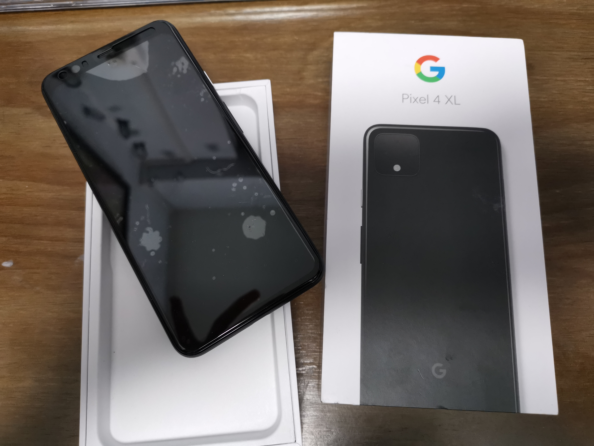
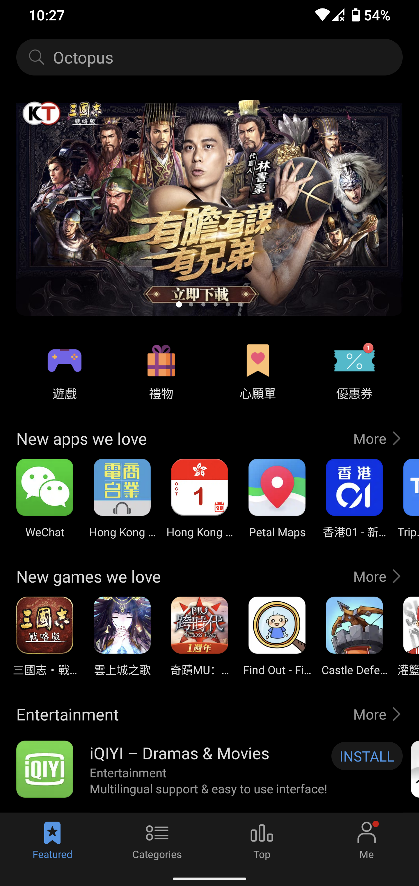

## Motivation

This is my first post since 2021, and trust me I have my reasons. Unlike the typical new year resolutions of getting fit, quit smoking, learn a new hobby etc. I've decided to try to tame this little spy we kept right next to us everyday - smart phone. My first smartphone was the iPhone 5, I know, I was pretty late to the game. Then I continued to be an iPhone user until I got a 'budget flagship' Huawei Mate 20 pro phone. I wouldn't call myself a Snowden, obviously there was no reason to, but I had been cautious. I would disable personalized ads, toggle off geographical tracking and remove Youtube history, but I still felt like I was still leaving my digital footprint everywhere. 

I had found out about [Graphene OS](https://grapheneos.org/), a security hardened FOSS mobile OS, in December and I have decided to take a leap of faith. I purchased a used, but in really good condition (95% new) Pixel 4 XL off Carousell. A lot of people think that buying a Pixel just for the sake of Graphene OS official support isn't worth it, but loads of features weren't available to international users anyways (motion sensing, car crash alert, Google Fi, the list goes on). Google doesn't give a F about international users. So it's really important to just get the Pixel at the price point which you think is worth it. I paid $3.6K for mine and I think it's a fair price for the features I'm getting.

## Setting up

It wasn't hard to install it on a formatted Pixel. The [official guide](https://grapheneos.org/install/cli) itself is pretty comprehensive, and if you want something more visual, there are loads of Youtube tutorials out there, [this video by The Hated One](https://www.youtube.com/watch?v=xIXAzA555xk) for example. Since my work PC is a Manjaro, it makes things so much easier.

## Using Graphene OS as my main driver

Daniel Micay did an amazing job. For the most part, Graphene OS is very much usable as a daily driver, everything works as promised and it's stable. I could run a surprising amount of apps on it. The security features are very rich and intuitive, I especially love how the permission options of all apps were organized under one single place and it's clear straightaway what apps were using what features. Graphene OS is very strict about what you're installing on your phone and it does an exceptional job at stopping app from running on its own (which comes as one of the cons, which I will explain later). If you killed an app, it's really killed, if you disabled its internet access, it really does what it's told. To me, I think the Graphene OS is extremely empowering and user oriented. 

However, after months of using Garphene OS as my main driver, I am really considering reverting back to the factory Android OS. There are features that I really needed but did not work on Garphene OS.

### 1. Octopus
I would say this is more of a regional demand so I don't expect users from other countries (cities even) to have this need. Before switching to Garphene OS, I relied *so much* on this app for topping up on the spot, paying my friends back into their Octopus card, transferring money to friends etc. But this app wouldn't work without Google Play Services. I tried installing the Huawei Mobile Service (HMS) core, which, to be honest, isn't something you'd want if you're on Graphene, but it was not working for obvious reasons. My life without the Octopus app was a little inconvenient, but it's not so much a deal breaker.

As of writing, I couldn't get the AppGallery to work anymore, which means no updates and no screenshots for the Octopus app. But just take my word for it, it doesn't work here.

### 2. Carrier app
I use Bridie and for the longest time it was not working on Graphene OS for me because I didn't have Google Play Services. But I recently discovered that it would still work with the apk downloaded version of Huawei AppGallery. I guess not anymore since I can no longer get the AppGallery to work...

### 2. Carousell
Message notifications do not work on Graphene OS! Since I'm a really big fan of thrift shopping, this isn't so nice. But it's just a little nuisance, because I'd usually check the app when I feel like it and I won't want to be bothered when I'm busy. So this again is fine, I could live by it.

### 3. Calendar
Now, we're getting to more serious issues. I rely on a physical panner for micro planning (hour scale) and I absolutely needed a digital calendar for fixed events and appointments, such as lectures, seminars, homework dues etc. I have been on Outlook calendar ever since switching to Graphene, the widget works fine, the notifications worked, but it was just never to the level of Google Calendar. What's worse, I found that there this [Event Calendar](https://github.com/Zren/plasma-applet-eventcalendar) that was natively integrated into Plasma KDE, and it's incredibly convenient and beautifully implemented, I just couldn't resist using it!

It syncs with Google calendar and Google calendar alone... Google calendar does not work on Graphene OS. I downloaded it through Aurora and tried opening it, but no matter what I do, it doesn't respond after tapping. Right now, my life is torn apart on Outlook and Google, some events were on Google, some were elsewhere, it's extremely messy.

### 4. Social media in general

#### Slack
Even though Slack isn't a big thing in my lab, I really wished it would send me notifications. But I have learn that [Slack doesn't support notifications without GPS](https://slack.com/intl/en-hk/help/articles/360001559367-Troubleshoot-Slack-notifications).

>Note: Google Play Services is needed to receive notifications on Android. Make sure your device is supported. 

### Instagram, Mastadon, Twitter, Reddit
None of these will send me a notification even if I toggled the battery optimization off. The official apps work well on Graphene OS, but your friends' DM nor your subscription update wouldn't send you any notifications at all. Messaging apps, on the other hand, like Signal and FOSS Telegram works perfectly fine, notifications were spot on, no GPS needed.

### 5. Finance and stock notifications
After dipping my toes in the stock market, I really wished Graphene OS would have allowed notifications or persisted background running for some apps. I never got any news notifications from the Investing.com app nor the broker app. I haven't invested heavily in one particular security, but if I do so in the future, I would want its news pinged to me.

### 6. Games
Most modern games on the Play Store requires GPS, if you don't have it, forget it. I was never a huge mobile gamer, but I wish I had Asphalt on my phone. But games don't really bother me much.

## Final thoughts
IMO, Graphene OS is very much usable, and I wish it would be more popular so that apps would really reconsider if they needed GPS in order for the app to just run. Graphene OS is amazing if you want a distraction free phone, you literally have no way to get it to send you distracting DMs or social media pings. But you also don't get important updates like news and subscriptions, which might be a good thing for some people! Price alert and financial news are important to me now, so I think I am done with this OS. There was no way to really de-Google entirely, I still had Google Maps, Translate and NewPipe on my Graphene OS phone anyways. I'm also not Snowden nor targeted, so I think [privacy-optimizing the stock Android ](https://chriswiegman.com/2020/04/limiting-my-exposure-to-surveillance-on-android/) would be enough for me.

TL;DR Google Play Services is the ultimate evil.

Thanks for reading, I might spend the next 30 mins reverting my phone back to the stock Android 🙃